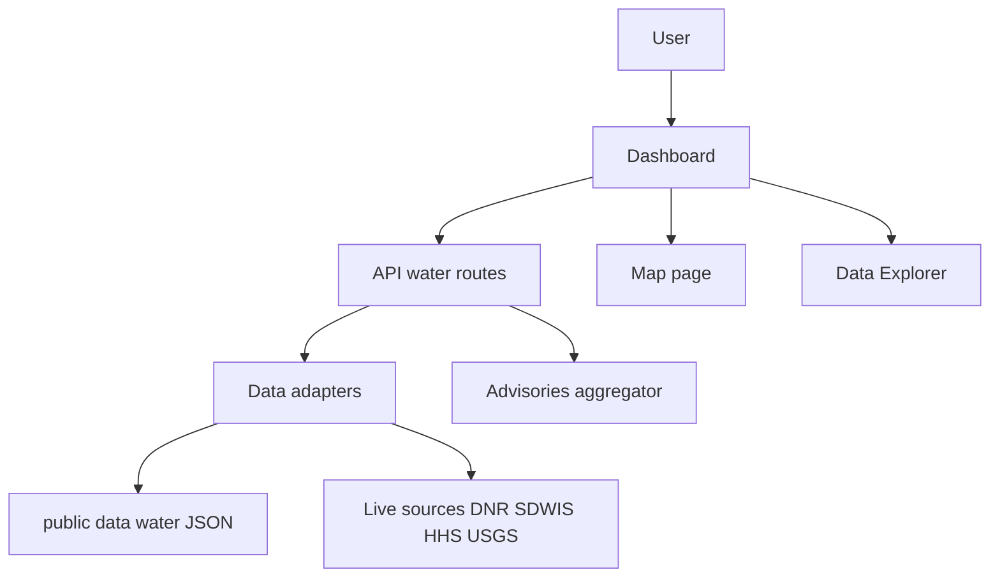

# Iowa Water Quality Dashboard POD (Plan of Delivery)

Objective
- Convert the existing UN Climate Next.js template into a public Iowa Water Quality Dashboard focused on nitrate, nitrite, bacteria, PFAS, arsenic, DBPs, and fluoride.
- Deliver a split workflow for two contributors working in parallel with clear contracts and acceptance criteria.

Team tracks
- Person A owner Data and API
- Person B owner UI, Map, and UX

Contract to unblock parallel work
- Agree on a single normalized WaterSeriesResponse JSON shape and endpoint list.
- Add the type file at [src/types/water.ts](src/types/water.ts) with schemas and enums for contaminants and advisories.
- Document the endpoint inventory in [README.md](README.md).

Milestones and timeline
- M0 contract Day 0 WaterSeriesResponse defined, endpoint inventory listed.
- M1 end of Week 1 Dashboard shows nitrate and bacteria cards plus advisories list using stub data and API routes.
- M2 mid Week 2 PFAS, arsenic, DBP, fluoride endpoints live; Map and Explorer functional on stub data.
- M3 end Week 2 Accessibility pass, content and methodology page, deploy settings complete.

Phase 0 rebrand and scaffold
- Replace brand assets and labels
  - Update sidebar brand text in [src/components/app-sidebar.tsx](src/components/app-sidebar.tsx)
  - Update header title and favicon in [src/app/layout.tsx](src/app/layout.tsx) and [src/app/favicon.ico](src/app/favicon.ico)
  - Add new logos under [public/iowa-water](public/iowa-water)
- Scaffold water dashboard
  - Replace ClimateCharts in [src/app/dashboard/page.tsx](src/app/dashboard/page.tsx) with a WaterCards shell
  - Prune climate dataset registry in [src/data/datasets.ts](src/data/datasets.ts) and add an Iowa Water group placeholder
- Seed stub data
  - Create JSON stubs under [public/data/water](public/data/water) for nitrate, nitrite, ecoli, pfas, arsenic, dbp, fluoride

Track A Data and API Person A
Phase A1 Types and thresholds
- Add schemas in [src/types/water.ts](src/types/water.ts) including
  - WaterPoint with date and value
  - WaterSeriesResponse with metric, unit, source, updatedAt, region, points
  - Contaminant enum covering nitrate, nitrite, ecoli, pfas, arsenic, dbp, fluoride
  - Advisory type to represent boil water, swim, PFAS exceedances
- Add thresholds metadata in [src/lib/water/thresholds.ts](src/lib/water/thresholds.ts)
  - Per contaminant MCL or advisory value and units
  - Safe, warn, alert color tokens and short health copy

Phase A2 Data fetchers and ETL
- Implement state and federal data adapters in [src/lib/water/iowa-datasources.ts](src/lib/water/iowa-datasources.ts)
  - Iowa DNR Beach Monitoring E coli weekly
  - DNR PFAS dashboard export or tabular downloads
  - SDWIS or HHS public drinking water summaries for arsenic, DBPs, fluoride, nitrate, nitrite
  - IWQIS or USGS sensors for real time nitrate when available
- Add ETL scripts for non API sources under [scripts/water-etl](scripts/water-etl)
  - Cache to JSON under [public/data/water](public/data/water) for initial MVP
- Extend the existing test harness in [scripts/test-datasources.ts](scripts/test-datasources.ts) to validate new schemas

Phase A3 Server routes
- Create the following API routes returning WaterSeriesResponse with ISR caching
  - /api/water/nitrate at [src/app/api/water/nitrate/route.ts](src/app/api/water/nitrate/route.ts)
  - /api/water/nitrite at [src/app/api/water/nitrite/route.ts](src/app/api/water/nitrite/route.ts)
  - /api/water/bacteria at [src/app/api/water/bacteria/route.ts](src/app/api/water/bacteria/route.ts)
  - /api/water/pfas at [src/app/api/water/pfas/route.ts](src/app/api/water/pfas/route.ts)
  - /api/water/arsenic at [src/app/api/water/arsenic/route.ts](src/app/api/water/arsenic/route.ts)
  - /api/water/dbp at [src/app/api/water/dbp/route.ts](src/app/api/water/dbp/route.ts)
  - /api/water/fluoride at [src/app/api/water/fluoride/route.ts](src/app/api/water/fluoride/route.ts)
- Advisories aggregator
  - /api/water/advisories at [src/app/api/water/advisories/route.ts](src/app/api/water/advisories/route.ts)
  - Merge boil water notices, swim advisories, and PFAS exceedances

Phase A4 Alerts logic and quality
- Implement status evaluation in [src/lib/water/alerts.ts](src/lib/water/alerts.ts)
  - Determine safe, warn, alert using thresholds and sample recency
- Add zod validation at API boundaries
- Add simple server logging and error handling

Track B UI, Map, and UX Person B
Phase B1 Hooks and cards
- Create a client hook [src/hooks/use-water-series.ts](src/hooks/use-water-series.ts) mirroring the climate hook
- Implement a WaterCards grid [src/components/water/water-cards.tsx](src/components/water/water-cards.tsx)
  - Cards for Nitrate, Bacteria, PFAS first, then Arsenic, DBPs, Fluoride
  - Show latest value, delta, status color, and last updated date
- Add a trend chart card [src/components/water/water-trend-card.tsx](src/components/water/water-trend-card.tsx) for 1 year trends

Phase B2 Advisories and personalization
- Add an advisory list or banner [src/components/water/water-advisories.tsx](src/components/water/water-advisories.tsx)
- Add a location picker [src/components/water/location-picker.tsx](src/components/water/location-picker.tsx) storing city or ZIP in preferences

Phase B3 Map
- Add a map route in [src/app/map/page.tsx](src/app/map/page.tsx)
- Render public water systems and recreational sites with status colors
- Provide layer toggles for Drinking and Recreational indicators and a legend
- Tooltips should show value vs standard, last sample date, and a source link

Phase B4 Explorer and content
- Adapt the explorer at [src/app/explorer/page.tsx](src/app/explorer/page.tsx) to filter by contaminant, system, and date range, with CSV export
- Build contaminant info cards [src/components/water/contaminant-info-card.tsx](src/components/water/contaminant-info-card.tsx) driven from thresholds metadata

Phase B5 Navigation and rebrand
- Update labels in [src/components/nav-main.tsx](src/components/nav-main.tsx) to Dashboard, Map, Data Explorer, News, About
- Update site header and logo in [src/components/site-header.tsx](src/components/site-header.tsx) and assets under [public](public)

Division of work ready to assign
Person A Data and API
- [src/types/water.ts](src/types/water.ts)
- [src/lib/water/thresholds.ts](src/lib/water/thresholds.ts)
- [src/lib/water/alerts.ts](src/lib/water/alerts.ts)
- [src/lib/water/iowa-datasources.ts](src/lib/water/iowa-datasources.ts)
- [scripts/water-etl](scripts/water-etl)
- [src/app/api/water/*/route.ts](src/app/api/water)

Person B UI Map UX
- [src/hooks/use-water-series.ts](src/hooks/use-water-series.ts)
- [src/components/water/water-cards.tsx](src/components/water/water-cards.tsx)
- [src/components/water/water-trend-card.tsx](src/components/water/water-trend-card.tsx)
- [src/components/water/water-advisories.tsx](src/components/water/water-advisories.tsx)
- [src/components/water/location-picker.tsx](src/components/water/location-picker.tsx)
- [src/app/map/page.tsx](src/app/map/page.tsx)
- [src/app/explorer/page.tsx](src/app/explorer/page.tsx)
- [src/components/water/contaminant-info-card.tsx](src/components/water/contaminant-info-card.tsx)
- [src/components/nav-main.tsx](src/components/nav-main.tsx)
- [src/components/site-header.tsx](src/components/site-header.tsx)

Endpoints inventory
- GET /api/water/nitrate params systemId optional zip optional
- GET /api/water/nitrite params systemId optional
- GET /api/water/bacteria params systemId optional type ecoli
- GET /api/water/pfas params systemId optional
- GET /api/water/arsenic params systemId optional county optional
- GET /api/water/dbp params systemId optional kind tthm haa5
- GET /api/water/fluoride params systemId optional
- GET /api/water/advisories params type boil swim pfas

Data status conventions
- safe value below 50 percent of standard
- warn between 50 percent and 100 percent or stale data beyond policy
- alert at or above standard or official advisory present

Acceptance criteria by milestone
- M0
  - water types committed at [src/types/water.ts](src/types/water.ts)
  - endpoint list added to [README.md](README.md)
- M1
  - nitrate and bacteria API route files exist and return stub WaterSeriesResponse
  - WaterCards shows nitrate and bacteria cards on [src/app/dashboard/page.tsx](src/app/dashboard/page.tsx)
  - advisories list rendered from /api/water/advisories
- M2
  - PFAS, arsenic, DBP, fluoride endpoints return stub data and status
  - /map shows markers with layer toggles and tooltips
  - explorer filters by contaminant and system and exports CSV
- M3
  - a11y contrast verified, ARIA labels on charts and map
  - content pages include sources and methodology
  - deploy settings documented and live demo reachable

Risks and mitigations
- Data freshness and gaps note last sample date prominently; show system status transparency
- API variability use zod validation and fall back to cached JSON
- PFAS evolving standards centralize limits in thresholds metadata for quick updates

Mermaid overview

Next steps checklist
- Create [src/types/water.ts](src/types/water.ts) and push a JSON example to unblock B
- Seed minimal stubs under [public/data/water](public/data/water) for nitrate and bacteria
- Replace ClimateCharts with WaterCards shell in [src/app/dashboard/page.tsx](src/app/dashboard/page.tsx)
- Create the first two API routes and wire WaterCards
- Schedule M1 demo and review